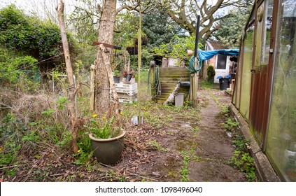
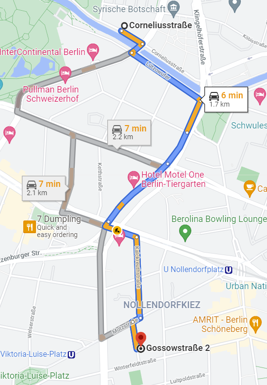

<link href="../styles.css" rel="stylesheet">  

 Back 

# Garden in Need of Help

My garden is in desperate need for someone to come take care of it.

## Directions

<button onclick="window.location.href='./jobreg';">Register</button>